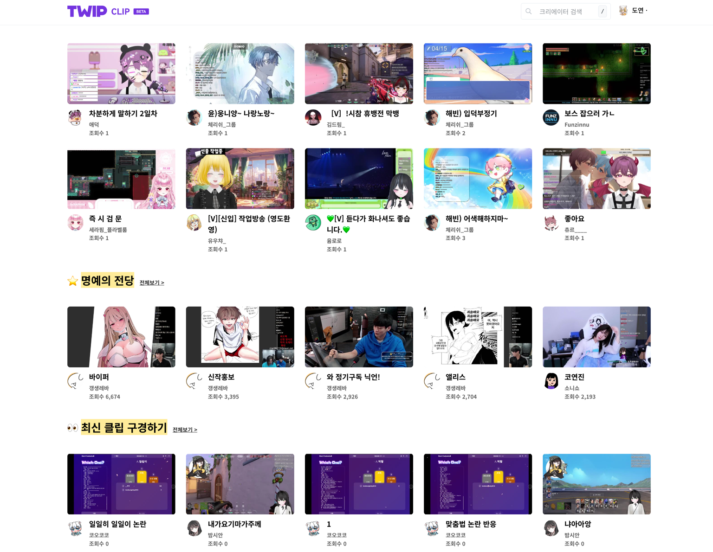

# TWIP CLIP 개편



### 개요

트위치코리아의 클립 서비스가 퇴역이후, TWIP VOD\&CLIP 서비스를 출시하여 방송 다시보기와 클립 다시보기를 제공하고 있었습니다. \
VOD를 제외하고 클립 기능을 확대, 개선하여 TWIP CLIP서비스로 리뉴얼 출시하는 과정에 함께했던 경험입니다.

<figure><figcaption></figcaption></figure>

<figure><figcaption></figcaption></figure>

<figure><figcaption></figcaption></figure>

<figure><figcaption></figcaption></figure>

2023년 5월 24일 CBT전환을 기점으로 항상 100개 이상의 클립이 매일매일 만들어지고 있었으나, 2023년 12월 26일, 사내에서 더 이상 유지 보수가 어려운 상황이 되어 아쉽게 퇴역하였습니다.

### 개발환경

* NestJS
* Sequelize
* MariaDB, Redis
* Cloudflare R2
* ffmpeg

### 경험

#### 클립을 이용한 영상후원 사용 가능하게 하는 작업&#x20;

트위치코리아의 클립 서비스가 퇴역하면서 트위치 클립을 이용한 후원이 중지되어 있는 상태였는데 해당 부분을 부활시키고, 클립 후원 형식에 맞춰 영상후원이 보이게끔 조절하였습니다. 사내 서비스 파악을 위해 온보딩 목적으로 수행하게 되었습니다. 오버레이 작업이 처음이라 분석하는데 시간이 걸렸지만, 추후 뽑기후원 이해에 큰 도움이 되었습니다.&#x20;

#### ffmpeg 사용하여 영상 길이 편집

클립의 대상이 되는 원본영상을 ffmpeg을 이용해 자르고, aws sdk를 통해 cloudflare R2에 저장하는 작업을 하였습니다. 저장한 경로는 sequelize 를 통해 DB에 저장합니다.&#x20;

### 성과&#x20;

* MAU 최대 4.2만명 달성
* 지표가 매월 최소 20\~30% 이상씩 성장 중
  * 4월 28일 출시 이후, 5월 클립 생성 수 2,000여개에서, 매월 꾸준히 성장하여 10월에는 25,000여개까지 급성장 (5개월만에 1250% 성장)
  * 클립 조회수 역시 5월 대비 10월에 5배 이상 성장
* 2023년 10월 기준 매일 평균 800\~1,000여개의 클립 생성

