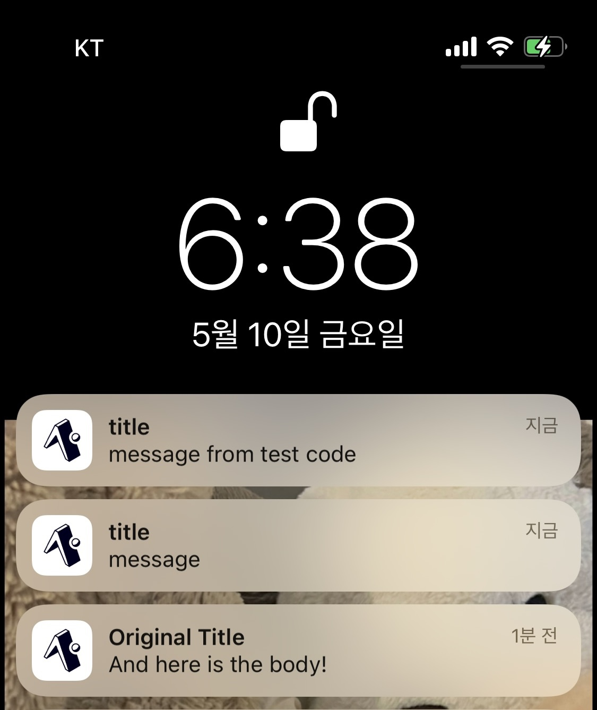

# 신규 서비스의 앱 푸시 알림 기능 개발

### 개요

<figure><figcaption></figcaption></figure>

**Backend**

* NestJS
* Sequelize
* postgresql, Redis
* AWS SQS, AWS EventBridge: scheduler
* RN: expo



### 경험

신규 서비스는 React Native - Expo를 이용해 구현된 소셜 네트워킹 어플리케이션입니다. \
Expo push notification 백엔드 파트를 구현하였습니다. \
알림 발송과, 발송이 잘 되었는지를 일정 시간 후에 확인하는 알림 워커를 별도로 작업하고, 그 과정에서 AWS SQS와 EventBridge-scheduler을 활용하였습니다.

### 성과 및 회고
